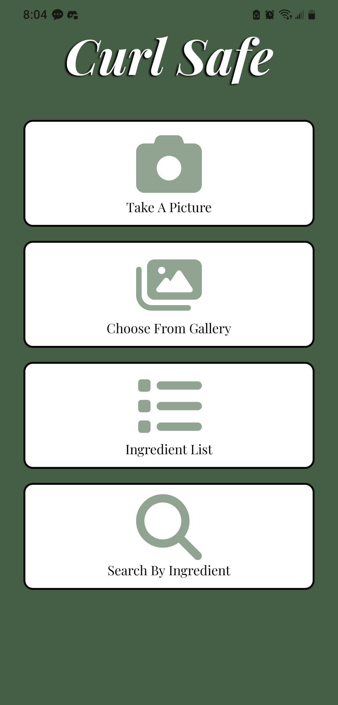
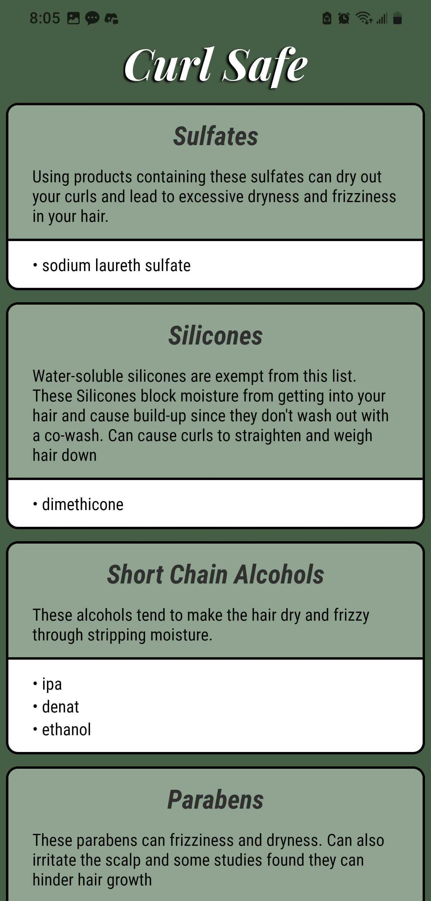

# Curl Safe - Front End
An app that uses Google's VisionAI API to scan hair product ingredient labels. In the curly/wavy hair world there is a movement called the Curly Girl Method (CG Method). The Method is used to make healthy hair specifically for curly/ wavy hair individuals. CG Method consists of not using hair products that contain certain ingredients- Sulfates, Silicones, Short Chain Alcohols, Parabens, Formaldehydes, Soaps, Waxes, Mineral oils. The issue is, there are over 100 of these ingredients! How can an individual check a tiny ingredients label and make sure to check for each one? 
This is exactly what Curl Safe solves. 

Check out the [Backend](https://github.com/JpadillaCoding/CurlSafe-Backend)!

## Installation 
Available on the [Google Play store](https://play.google.com/store/apps/details?id=com.CurlSafe)!

Available on the [App Store](https://apps.apple.com/us/app/curlsafe/id6450194570)!

## Technologies 

React Native was picked for its ease of implementation for both IOS and Andriod. Used the power of the react components to make scalable buttons, ingredient lists, and navigable screens. The backbone of this project is manipulating state to dynamically render the results of the analyzer. 

Redux worked great for managing state used on different screens. Moving state between the Flatlist component was a bit of a hassle, and redux takes care of that by making state usable on any component!

The Expo package made testing code extremely easy. It also has many packages that come in very handy for native development. Dependencies used in this project are Google fonts, camera, and image picker- all essential tools for picking an image to analyze and making a beautiful app!

## Upcoming Features

- Allergies: User will add ingredients they are allergic to which the analyzer will look for. 

- Add a button that leads to other resources- the acknowledgement list in this readme

## Screenshots

## Bugs Spreadsheet 

A peer introduced me to tracking bugs for 4 reasons. 
- Being able to reference what I did for problems that may pop up again
- Even if it's not the same problem, the archive can help me debug. 
- Save time by avoiding duplicate work and by ensuring that bugs are not being overlooked 
- Showing future employers problems that I come across and how I was able to handle them

Ever since I was introduced, I've introduced the bug tracking system.
Check out the [spreadsheet](https://docs.google.com/spreadsheets/d/1AnkQHyOJvGC9OME0xiNRgRaY0g2Fr8wp9TOr22Vx2eo/edit?usp=sharing)!

## Acknowledgments 

- This app was inspired by the CG Method- A guideline for taking care of  Natural hair. Originally made by Lorraine Masse- Check out her [book](https://a.co/d/0DKIAwM)!

- The curly hair [subreddit](https://www.reddit.com/r/curlyhair/) which first introduced me to proper care of curly hair.

- [Curls bot](https://www.curlsbot.com/) A website that lets you type in ingredients to check if they're on the CG method do not use list. 

- [Curl Scan](https://curlscan.com/) A website that tells the user if a hair product is CG Method approved. Community-driven to keep expanding their database of products. 

